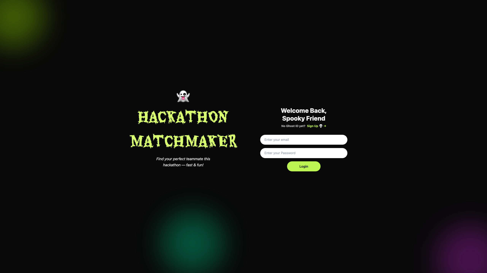
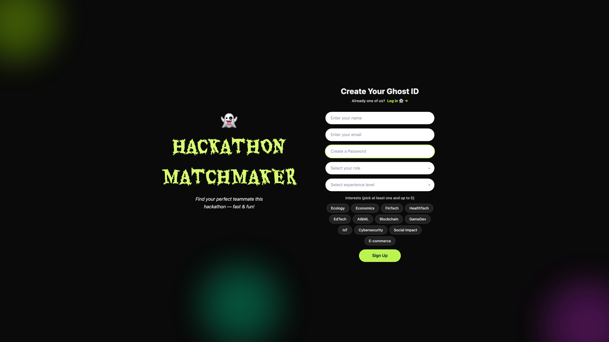
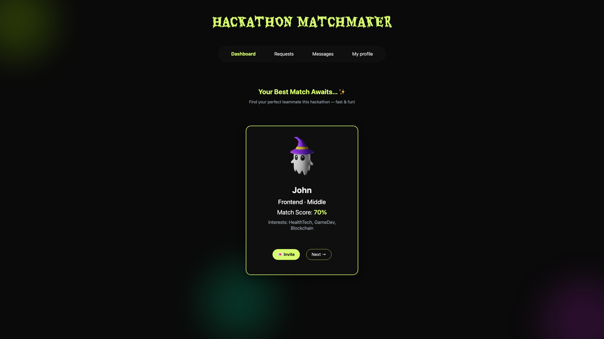
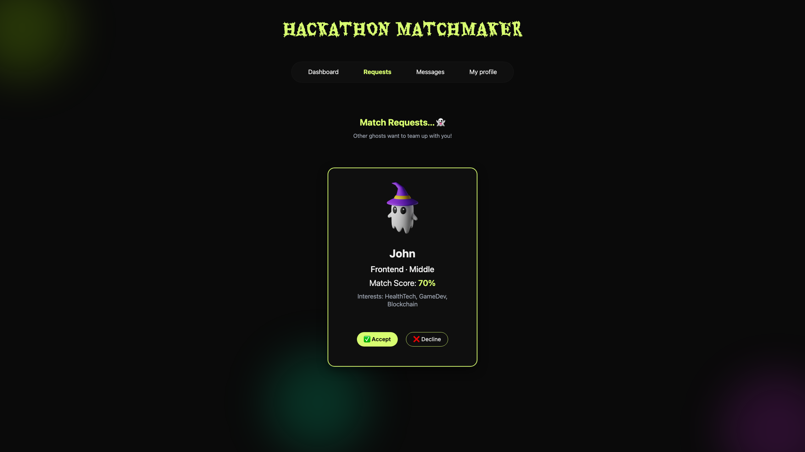
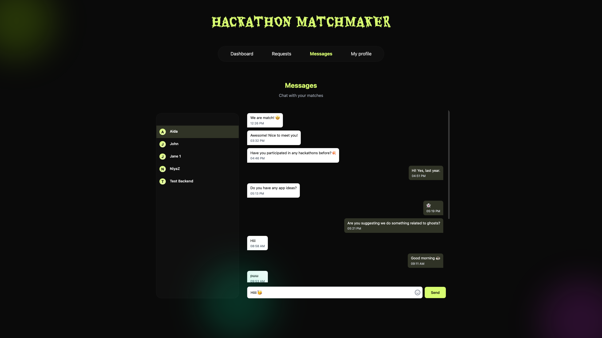
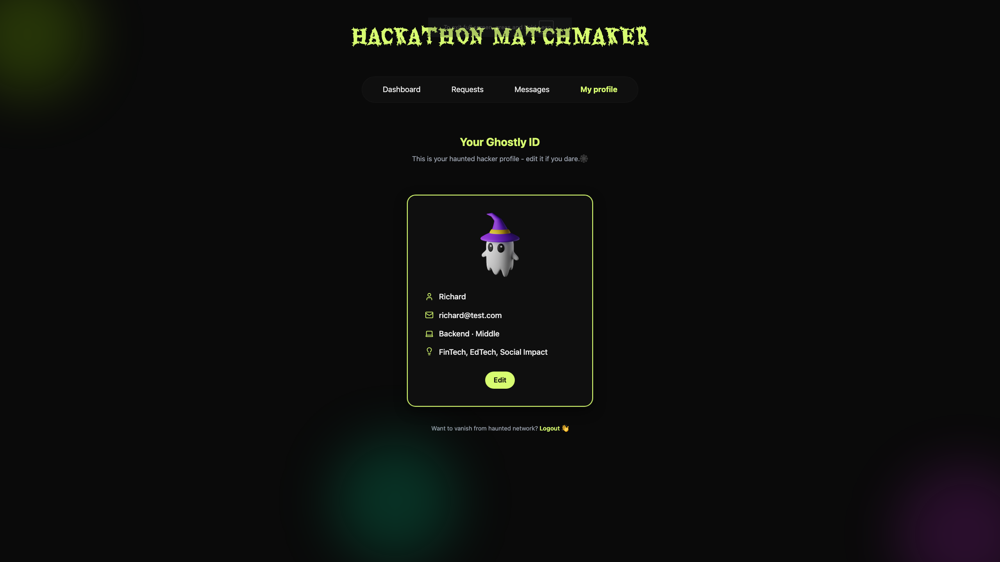

# 🎃 Hackathon Matchmaker 🏆
### **🏅 1st Place Winner** - *"Unearthing Value" Halloween Hackathon Powered by MetLife*
### **⚡ Built in 3 Days**
*Unearthing Hidden Value in Professional Connections*

A platform that helps hackathon participants find perfect teammates based on skills, interests, and roles.

## 🚀 Live Demo

You can test the application live here:

**[👉 Test it Live](https://hackathon-matchmaker-app.onrender.com/)**

## 📸 App Screenshots


### Login 
Secure authentication to access your account  
 

### Register
Create a new account with your skills and interests
 

### Dashboard 
Find Your Perfect Match
 

### Requests 
Manage Match Requests - accept or decline invitations
 

### Chat 
Chat with Your Matches - instant messaging with your matches
 

### Profile 
Your Information Hub - view and edit your profile, skills, experience, and logout
 

##
Basic project structure for hackathon matchmaker application.

## Project Structure

```
├── frontend/          # React + Vite frontend
├── backend/           # Node.js + Express backend
└── package.json       # Monorepo configuration
```

## Technologies

- **Frontend**: React + Vite (JavaScript)
- **Backend**: Node.js + Express (JavaScript)

## Development

### Run everything
```bash
npm run dev
```

### Run separately
```bash
# Frontend only (http://localhost:5173)
npm run dev:frontend

# Backend only (http://localhost:3000)
npm run dev:backend
```

## Installation

```bash
npm install
```

## 🔍 Semantic Matching (ML Microservice)

In addition to the rule-based matching logic, the project includes an **optional ML-powered semantic similarity microservice** that improves match quality when user interests are expressed using different but related terms.

### How it works

- A **Python FastAPI microservice** computes semantic similarity between user profiles using **sentence-transformers (all-MiniLM-L6-v2)**.
- The backend sends two user profiles as text to the ML service:
  - **Interests** (selected during registration)
  - **Free-text bio** (if provided)
- The service returns a normalized cosine similarity score (`0.0 – 1.0`) based on sentence embeddings.

Example:
- `"react developer frontend"` ↔ `"vue developer frontend"` → high similarity  
- `"react developer frontend"` ↔ `"banana developer frontend"` → low similarity  

### Integration Design

- The Node.js backend calls the ML service via HTTP:
  - `POST /similarity`
- Profile text is built deterministically from user data:
  - `interests + bio`
- The integration is **fault-tolerant**:
  - If the ML service is unavailable or not configured, the system **automatically falls back** to baseline rule-based matching.
  - No user-facing errors or blocked requests.

### Relevant Files

- ML client (Node.js):  
  `backend/src/services/mlClient.js`
- ML microservice (Python):  
  `ml-service/app.py`

### Set backend environment variable:
ML_SERVICE_URL=http://localhost:8000

### Run ML Service Locally

```bash
cd ml-service
python3 -m venv .venv
source .venv/bin/activate
pip install -r requirements.txt
uvicorn app:app --reload --port 8000

